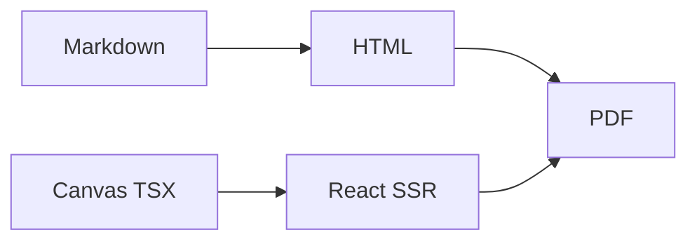

# Пример Markdown-главы

Короткий фрагмент, чтобы проверить, что MD и canvas собираются одним конвейером.

| Источник | Как попадает в PDF |
|---|---|
| `.md` | marked + mermaid |
| `.canvas.tsx` | esbuild + runtime `cursor/canvas` |
